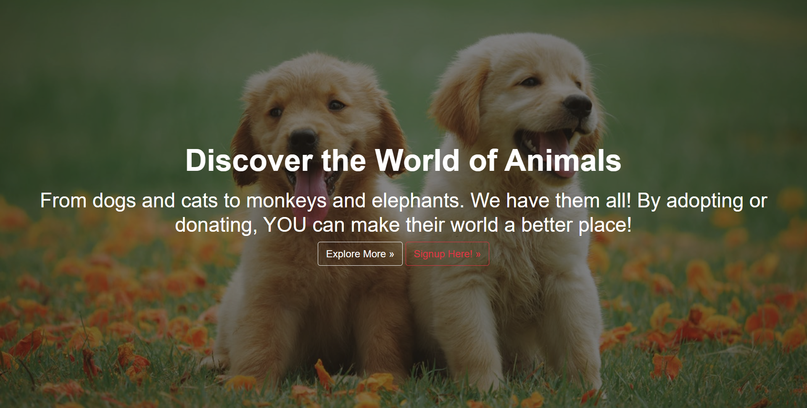
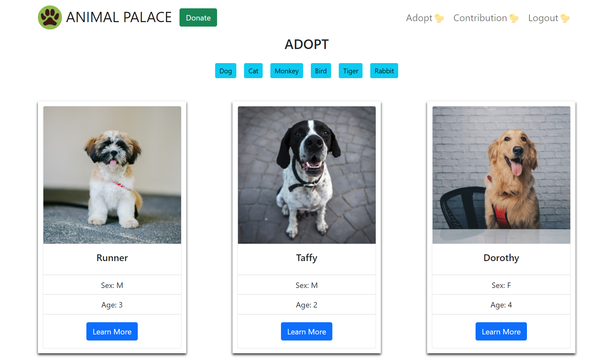

# Animal Palace

## Description

As animal lovers, this application was created to encourage people to donate money to Animal Palace to help animals in need. Users are able to sign up, donate and symbolically adopt animals. Everyone will be able to view the animals in our shelter, but users must create an account to begin donating through Stripe. Users who donate are then able to symbolically adopt the animals. Users are able to view their contributions to see how many animals they have adopted with a list of the selected animals adopted. Furthermore, users are able to see how much they have donated in total to the cause.

## Table of Contents

- [Technologies](#technologies)
- [Preview](#preview)
- [Contributors](#credit)
- [Launch](#launch)
- [License](#license)
- [Badges](#badges)

## Technologies

- CSS
- JavaScript
- React
- GraphQL
- MongoDB/Mongoose
- Node.js
- Express.js
- Stripe

## Preview

## Contributors

Any questions or comments? Reach out to us through our GitHub!

[Brian Smith](https://github.com/bjtsmith23), [Ken Crawford](https://github.com/kencford), [Betty Chen](https://github.com/bchen41), and [Marc Negron](https://github.com/negronmarc)

## Launch

[Heroku](https://animal-palace.herokuapp.com/)

## License

MIT License

    Copyright (c) [2022] [Betty Chen, Ken Crawford, Marc Negron, Brian Smith]

    Permission is hereby granted, free of charge, to any person obtaining a copy
    of this software and associated documentation files (the "Software"), to deal
    in the Software without restriction, including without limitation the rights
    to use, copy, modify, merge, publish, distribute, sublicense, and/or sell
    copies of the Software, and to permit persons to whom the Software is
    furnished to do so, subject to the following conditions:

    The above copyright notice and this permission notice shall be included in all
    copies or substantial portions of the Software.

    THE SOFTWARE IS PROVIDED "AS IS", WITHOUT WARRANTY OF ANY KIND, EXPRESS OR
    IMPLIED, INCLUDING BUT NOT LIMITED TO THE WARRANTIES OF MERCHANTABILITY,
    FITNESS FOR A PARTICULAR PURPOSE AND NONINFRINGEMENT. IN NO EVENT SHALL THE
    AUTHORS OR COPYRIGHT HOLDERS BE LIABLE FOR ANY CLAIM, DAMAGES OR OTHER
    LIABILITY, WHETHER IN AN ACTION OF CONTRACT, TORT OR OTHERWISE, ARISING FROM,
    OUT OF OR IN CONNECTION WITH THE SOFTWARE OR THE USE OR OTHER DEALINGS IN THE
    SOFTWARE.

## Badges

## License Link

[Click Me](https://opensource.org/licenses/MIT)
